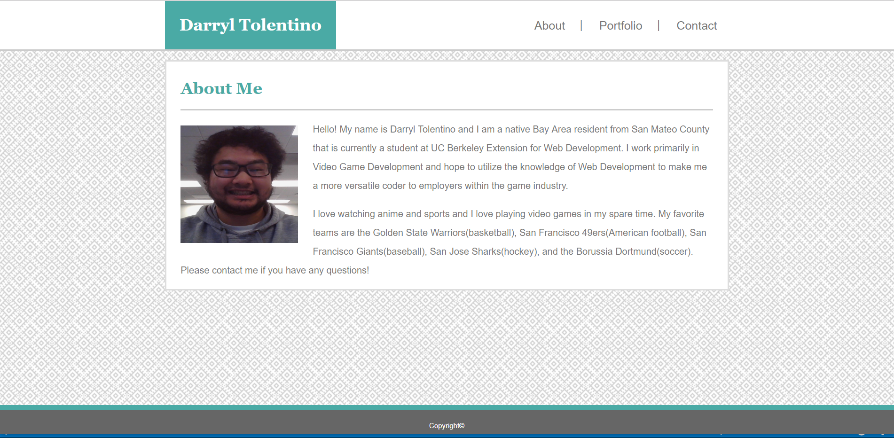
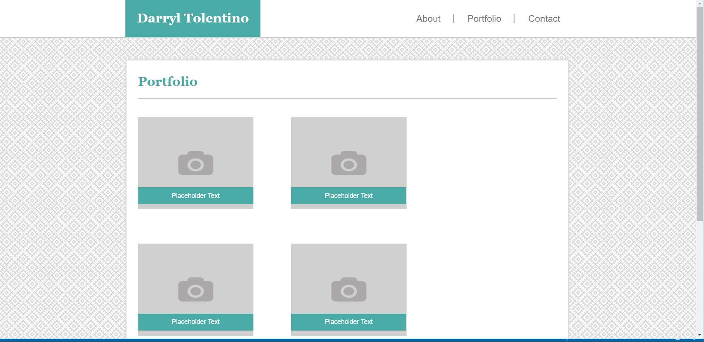
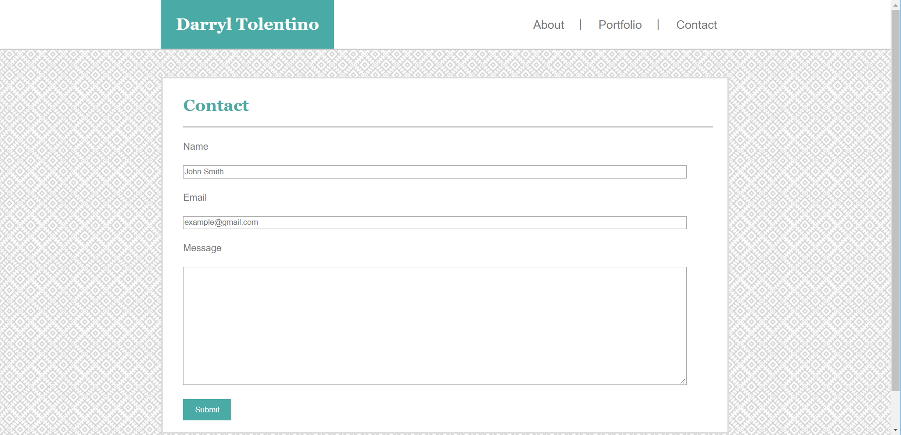

# Responsive-Portfolio

[Link to the Github Pages website](https://darryljltolentino.github.io/Responsive-Portfolio/)

This is the basic portfolio website that uses media queries for the responsiveness of the website based on browser size. Each page has a breakpoint for 980px, 768px, and 640px browser widths.
The About Me page has a photo of myself and a description of who I am as a developer and a person. My Portfolio page currently has five placeholder images with placeholder text that will be linked to future projects. The Contact Form provides a place to give a name, email, and a message field in order for someone to contact me via the website.

## Technologies Used
1) [HTML](https://developer.mozilla.org/en-US/docs/Web/HTML)
2) [CSS](https://developer.mozilla.org/en-US/docs/Web/CSS)